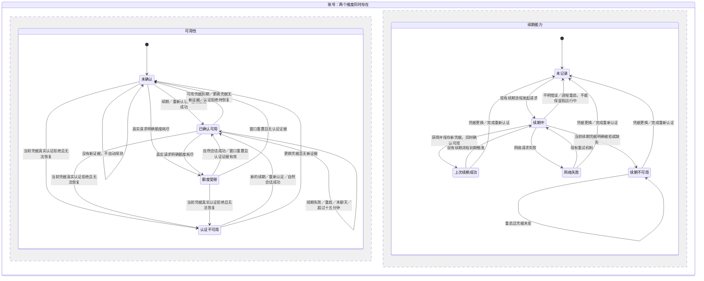

# 账号可用性、续期能力与界面映射

账号同时记录两个维度：**可用性 × 续期能力**。界面没有灰色状态：未知统一使用黄色并提供账号绑定钥匙，不表示账号可用、失效，或后台正在探测。续期尚无结论时不能冒称“续期不可用”。

续期成功、完成并保存的同账号重新认证均提供正向认证证据，无需补发模型请求。续期失败不能反推出会话不可用。正常不保证额度充足或任意模型请求必定成功。

“独立”表示分别保存，事件可以同时更新两部分。重新认证成功确认可用并清除旧续期错误，但不假称完成过一次续期。已知额度限制不会仅因续期或重新认证成功清除。

## 界面表格

| 可用性 | 续期能力 | 界面 | 重新认证钥匙 |
| --- | --- | --- | --- |
| 已确认可用 | 上次续期成功或未记录 | 正常；临近到期沿用原提示 | 沿用原规则 |
| 已确认可用 | 续期不可用 | 青蓝色“续期不可用（账号仍可用）” | 有 |
| 未确认 | 续期不可用 | **黄色“续期不可用（会话状态未知）”** | **有** |
| 已确认可用或未确认 | 网络失败 | 黄色“续期失败” | 有 |
| 已确认可用或未确认 | 续期中 | 中性“正在续期” | 沿用原规则 |
| 未确认 | 未记录或旧成功已不适用 | **黄色“会话状态未知（无续期结论）”**，不是另一种灰色状态 | **有** |
| 认证不可用 | 任意 | 红色“访问令牌失效” | 有 |
| 额度受限 | 任意 | 配额提示，不显示认证失效红框 | 沿用原规则 |

两维原始状态保留在 `availability`、`renewal` 字段，证据时间为 `availabilityObservedAt`。兼容状态名 `refresh_unavailable_unverified` 和 `unverified` 都映射为黄色 `availability_unknown`；两者仅区分续期是否已经明确不可用。不存在灰色“可用性待确认”标签。`refresh_unavailable` 使用独立的青蓝色 `health-usable` 样式，不改变其他黄色警告。

当前、非当前、隐藏账号使用相同的青蓝／黄色规则和钥匙。隐藏、选中、悬停不能盖住状态颜色；隐藏标签仍保留。忽略提示、虚拟账号、仅手动账号及忙碌状态沿用原规则。钥匙绑定原账号；登录错账号、取消、失败或凭据未保存，均不能清除原状态。

## 青蓝色何时转黄色

必须同时满足：**当前凭据续期明确不可用，且之前的可用证据不再适用，也没有新的有效证据。**

- 已确认可用的访问凭据到期，正向证据随之到期。
- 更换访问凭据，旧证据不能用于新凭据。只有新凭据的续期也已明确不可用，才进入黄色“续期不可用（会话状态未知）”；不能套用旧续期错误。尚无新续期结论时显示黄色“会话状态未知（无续期结论）”。
- 重启、关闭面板、隐藏账号、切到其他账号、没有聊天、经过十五分钟、配额或网络错误，不会单独令青蓝色的可用证据失效。
- 当前凭据明确认证拒绝且无法恢复，应转红色；续期成功应转正常。

## 证据、持久化与隔离

- 自然会话观察在请求开始时绑定账号、工作区、实际凭据摘要、运行实例、序号。处理时再次核对当前凭据；其他账号、工作区、旧凭据或旧运行实例的新通知会被拒绝。
- 续期成功只在取得并保存凭据后记录。缓存读取、配额成功、请求开始被接受，不是新的成功证据。
- 完成 OAuth 交换并保存同账号凭据后才记录重新认证成功，身份匹配检查先于写入。
- 已接受的证据存入当前宿主的 VS Code 扩展本地存储，按账号分别写入。只保存状态、时间、账号标识和凭据摘要，不保存令牌或邮箱，不注册云同步，不进入共享账号文件。
- 重启恢复证据；更换运行实例只影响新消息准入，不清空已经接受且仍适用的证据。
- 自然会话成功与续期／认证成功均按访问凭据实际到期时间判断，不设固定十五分钟有效期。无法解析有效期时不虚构期限，保留最近结果，仍由凭据更换和新的认证结果覆盖。
- `AVAILABILITY_TTL_MS` 仅限制新到达消息的传输时延，防止接受过旧通知，不用于删除已接受证据。
- 新的真实认证拒绝使旧正向证据失效，先尝试同账号恢复。恢复遇到网络或不明错误不能判红；恢复成功确认新凭据可用。
- 同一凭据已确认续期不可用时，不因重复通知不断重放续期。新的自然会话成功能清除红色，但保留续期失败，故转青蓝色。
- 额度属于账号，同账号换访问凭据不会自动清除额度限制。窗口重置时间本身不是认证可用证明。
- 本机旧续期记录只迁移一次：必须存在完整的续期开始与成功记录、耗时不超过一分钟、没有后续失败、当前凭据仍未到期，且签发时间落在该次续期时间范围内（允许五秒时钟误差），凭据所属账号须匹配。提供方未给工作区声明时，还须核对提供方用户标识与本地账号一致。只有成功时间、只有未到期凭据、配额成功都不够。
- 迁移后立即按当前凭据摘要保存原始成功时间，并持久标记已检查；换凭据或重启不能拿同一条旧成功记录重复证明另一份凭据。已有新版状态、真实拒绝或较新证据时，不以旧记录覆盖。不发起任何迁移探测请求。
- `invalid_refresh_token` 是续期凭据明确被拒，归入续期不可用，不直接判会话不可用。修复旧漏判时，必须同时匹配已保存的凭据摘要和同次错误时间；普通 401／403、历史配额错误不能套用此结论。

## 实现入口

- `src/application/accounts/accountState.ts`：凭据绑定、证据保存、恢复、到期和事件顺序。
- `src/application/accounts/observeAvailability.ts`：自然会话观察及同账号恢复。
- `src/application/accounts/health.ts`：两维状态到标签的映射。
- `webview-src/dashboard/savedAccountCard.tsx`、`media/webview/quotaSummary.css`：青蓝／黄色和钥匙。
- `test/accountStatePersistence.test.ts`、`test/accountHealth.test.ts`：持久化与状态测试。
- `test/commandService.test.ts`：重新认证成功、取消、错误账号的模拟测试。
- `test/savedAccountReauthorization.test.ts`：实际组件的样式类别和动作绑定测试，非真实浏览器测试。
